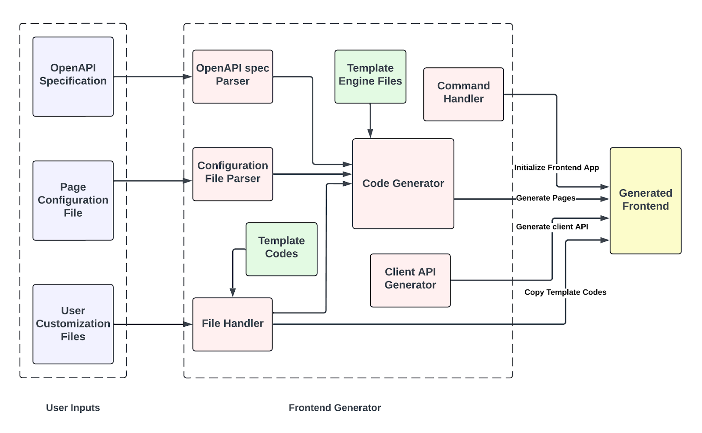
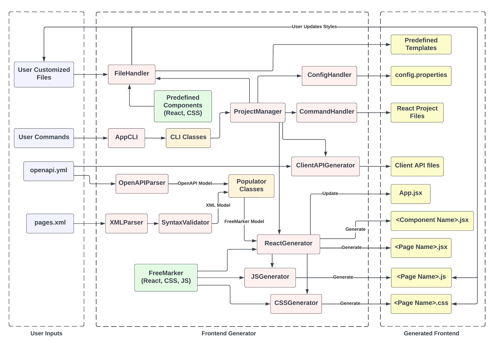

# Automatic Frontend Generation Framework

## Overview
This section is for developers who will refer to and work on the source code of the Automatic Frontend Generation Framework.

The framework automates the process of generating frontend components based on the OpenAPI Specification (OAS). It uses a modular and extensible architecture to ensure flexibility, maintainability, and ease of contribution.

This documentation provides an in-depth explanation of the architecture, key packages, and components of the FrontendGenerator Framework. It is intended for developers who wish to understand, extend, or maintain the codebase.

## Table of Contents
- [Technology Stack](#1-technology-stack)
- [Project Architecture](#2-project-architecture)
  - [High-Level Architecture](#high-level-architecture)
  - [Detailed Architecture](#detailed-architecture)
  - [Directory Structure](#directory-structure)
- [Key Packages](#3-key-packages)
  - [com.ravjar.cli](#comravjarcli)
  - [com.ravjar.config](#comravjarconfig)
  - [com.ravjar.core](#comravjarcore)
  - [com.ravjar.generator](#comravjargenerator)
  - [com.ravjar.handler](#comravjarhandler)
  - [com.ravjar.helper](#comravjarhelper)
  - [com.ravjar.model](#comravjarmodel)
  - [com.ravjar.parser](#comravjarparser)
  - [com.ravjar.populator](#comravjarpopulator)
- [Execution Flow and Command Lifecycle](#4-execution-flow-and-command-lifecycle)
- [Testing and Debugging](#5-testing-and-debugging)
- [Future Enhancements](#6-future-enhancements)

## 1. Technology Stack
- **Language:** Java  
- **Build Tool:** Maven  
- **Code Generation:** Freemarker templates  
- **Parsing:** OpenAPI and XML parsers  
- **Frontend Framework:** React (generated code)  
- **Testing:** JUnit  

## 2. Project Architecture
### High-Level Architecture

### Detailed Architecture

### Directory Structure
```plaintext
FrontendGeneratorJava/
├── docs/
├── src/
│   ├── main/
│   │   ├── java/
│   │   │   └── com.ravjar/
│   │   │       ├── cli/
│   │   │       ├── config/
│   │   │       ├── core/
│   │   │       ├── generator/
│   │   │       ├── handler/
│   │   │       ├── helper/
│   │   │       ├── model/
│   │   │       │   ├── freemarker/
│   │   │       │   ├── openapi/
│   │   │       │   └── xml/
│   │   │       ├── parser/
│   │   │       └── populator/
│   │   └── resources/
│   │           └── templates/
│   └── test/
├── README.md
└── README-dev.md
```

## 3. Key Packages
### com.ravjar.core
**Purpose:** Provides the entry point for executing CLI commands and manages project lifecycle operations such as initialization, frontend generation, and API integration.

**Key Classes:**
- `AppCLI`: Serves as the main entry point for the CLI, mapping commands (init, generate, apply, run, and test) to their respective subcommands.
- `ProjectManager`: This class acts as a central manager, coordinating the entire project lifecycle between handlers, parsers, generators, and file operations to streamline the framework's functionality.
   - **Project Initialization**: Creates the project structure, sets up configuration files, installs dependencies, and organizes directories for styles, components, and build outputs.
   - **Frontend Generation**: Parses the openapi.yaml and pages.xml files, generates React components, pages, and navigation bars using Freemarker templates, and applies user-defined styles.
   - **Client API Generation**: Creates client-side API integrations based on the OpenAPI Specification.
   - **Style Application**: Copies user-defined CSS and JavaScript files into the build directory.
   - **Project Execution**: Runs the React application for testing.
   - **Command Handling**: Updates the project state based on commands received via the CLI.

### com.ravjar.cli
**Purpose:** Provides command-line interface functionality, enabling users to execute various operations such as project initialization, frontend generation, API generation, style application, and project execution through commands.

**Key Classes:**
- `MainCommand`: initializes the CLI tool and provides basic instructions to users.
- `InitCommand`: Calls `ProjectManager.initializeProject()`, which handles project initialization (creating folder structures, configurations, etc.).
- `GenerateCommand`: Calls methods `ProjectManager.generatFrontend()` and `ProjectManager.generateClientAPI()` to generate React frontends and client-side APIs respectively.
- `ApplyCommand`: Calls `ProjectManager.applyUserStyles()` to apply user-defined logic and styles.
- `RunCommand`: Calls `ProjectManager.runProject()` to launch the React project on a local development server.
- `TestCommand`: Calls `ProjectManager.test()` to perform any testing logic defined in ProjectManager.

### com.ravjar.handler
**Purpose:** Provides utilities for managing file operations, handling project configuration files, executing external commands, and loading templates.

**Key Classes:**
- `CommandHandler`: Handles execution of external commands, such as creating a React app, running the project, and installing NPM packages.
- `ConfigHandler`: Manages the config.properties file, allowing reading, writing, and updating project configuration properties.
- `FileHandler`: Provides utilities for file and directory operations, including creating directories, copying files, and handling templates during project setup.
- `TemplatesConfigLoader`: Loads and parses the templates.json file, mapping source templates to their destinations.

### com.ravjar.parser
**Purpose:** Handles the parsing and extraction of data from OpenAPI specifications and XML configuration files.

**Key Classes:**
- `OpenAPIParser`: Parses and validates the OpenAPI Specification, extracting operations, parameters, schemas, responses, and other API-related data. It transforms raw OpenAPI data into structured models.
- `XMLParser`: Parses the `pages.xml` file to extract page definitions and configurations, converting them into structured objects.

### com.ravjar.config
**Purpose:** Configures and manages external libraries or utilities required for the framework, ensuring consistent and reliable integration with template engines and other configurations.

**Key Components:**
- `FreeMarkerConfig`: Provides a pre-configured Freemarker Configuration object to handle template loading, encoding, and exception handling.

### com.ravjar.generator
**Purpose:** Facilitates the generation of frontend assets, including React components, client-side APIs, CSS, and JavaScript files.

**Key Classes:**
- `ClientAPIGenerator`: Generates client-side API code based on the OpenAPI Specification using OpenAPI Codegen, and installs necessary dependencies for integration.
- `CSSGenerator`: Creates CSS files for styling React pages and components, leveraging Freemarker templates to dynamically adapt styles based on the configuration.
- `JSGenerator`: Generates JavaScript files for custom page-level logic and styling, using Freemarker templates to produce reusable and maintainable frontend scripts.
- `ReactGenerator`: Handles the generation of React components, pages, and navigation bars by processing input data from OpenAPI and XML configuration files. It also integrates generated CSS and JavaScript assets for a complete frontend setup.

### com.ravjar.helper
**Purpose:** Provides utility functions and helpers to support data conversion, transformation, and component population for use across the framework.

**Key Classes:**
- `OpenAPIConverter`: Converts string-based HTTP method names into their corresponding `PathItem.HttpMethod` enum values from the OpenAPI specification.
- `PopulatorHelper`: Facilitates the transformation of XML-defined components into their corresponding Freemarker-based components by delegating to specific populator classes for each component type.
- `StringConverter`: Offers utility methods for converting strings between different naming conventions, such as `toCamelCase` and `toKebabCase`, ensuring consistent formatting throughout the framework.

### com.ravjar.model
**Purpose:** Defines the foundational data models used throughout the framework, including Freemarker templates, OpenAPI specifications, and XML-based components.

**Sub-Packages:**
- `freemarker`: Models specifically designed for Freemarker templates, used in generating React components, pages, and styles.
- `openapi`: Provides models for OpenAPI specification elements, such as parameters, resources, schemas, and responses.
- `xml`: Provides models for XML elements, including components and other tags.

### com.ravjar.populator
**Purpose:** Handles the transformation of XML-defined components into FreeMarker-based models by mapping attributes and assigning values.

## 4. Execution Flow and Command Lifecycle

### I. Initialization (init --name <project name>)

Purpose: Sets up the project directory and initializes the React application.

Steps:
- Creates the project structure.
- Creates the project configuration file and sets up the project name.
- Initializes a React application.
- Install necessary NPM dependencies.

### II. Frontend and Client API Generation (generate)

Purpose: Generates the frontend and client API.

Steps:
- Parses openapi.yaml using OpenAPIParser to extract schema data.
- Parses pages.xml using XMLParser to extract page structures and component definitions.
- Creates FreeMarker data models using the extracted data from openapi.yaml and pages.xml.
- Populates FreeMarker templates with FreeMarker Models to generate:
  - React components & pages.
  - CSS and JavaScript templates for custom styling.
- Generates the client API using OpenAPI Generator Tools.

### III. Apply custom user styles (apply --styles)

Purpose: Applies user-defined custom styles to the frontend.

Steps:
- Copies user-defined custom styling files (CSS and JavaScript) into the build folder.

### IV. Running the Application (run)

Purpose: Launches a local server for testing.

Steps:
- Compiles the generated React application.
- Starts a local development server.

### V. Output Directory:

The generated files (React components, API integrations, and CSS) are placed in the build/ folder.

## 5. Testing and Debugging
- **Unit Tests:** Located in `test/`.
- **Logging:** Uses `java.util.logging`.
- **Error Handling:** Custom exceptions for invalid inputs.

## 6. Future Enhancements
- Support additional frontend frameworks (Angular, Vue).
- Introduce more component types.
- Improve CLI interactivity.
