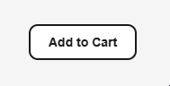
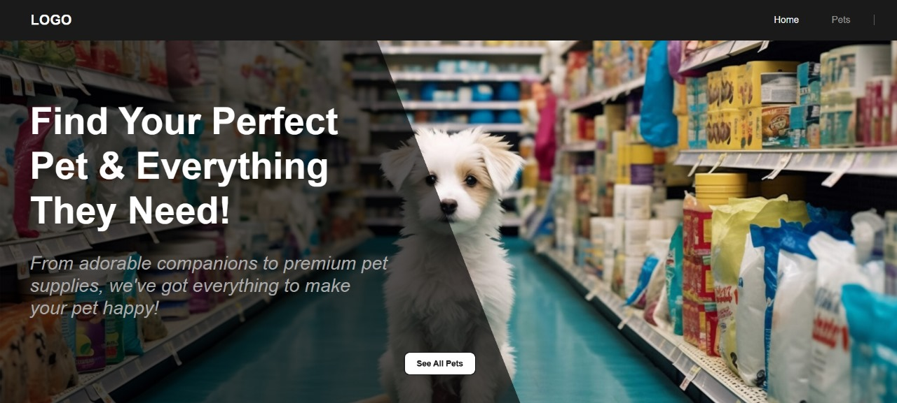

# Automatic Frontend Generation Framework


[](https://www.oracle.com/java/technologies/javase-downloads.html)
[](https://reactjs.org/)
[](https://www.openapis.org/)

Welcome to the **Automatic Frontend Generation Framework**! This project aims to streamline the process of building React-based frontends by automating the generation of UI components, pages, and client-side API integrations **directly from an OpenAPI Specification**.

This framework is specifically designed for backend developers and teams who need a functional, customizable frontend without diving deep into frontend technologies. By using configuration files such as the **Page Configuration File** and **User Customization Files**, along side with the **OpenAPI Specification**, the framework ensures that the frontend is always in sync with the backend while allowing flexibility in styling and structure.

### Key Features
- **Automatic React Frontend Generation**: Quickly generate fully functional React frontends from your API definitions.
- **Customizable Components and Pages**: Modify predefined styles or create custom page-specific styles with ease.
- **OpenAPI-Driven**: Leverages OpenAPI as the single source of truth to maintain backend and frontend consistency.
- **Ease of Use**: Designed to be simple and intuitive, requiring minimal effort to get started.

## Background

API-driven development has become a cornerstone of modern software engineering, enabling developers to build scalable and modular systems by decoupling backend services and frontend interfaces. This approach simplifies collaboration between teams, fosters reusability, and accelerates development cycles.

The **OpenAPI Specification (OAS)** has emerged as the standard for describing RESTful APIs in a machine-readable format. Originally introduced as part of the Swagger project, OAS is now governed by the OpenAPI Initiative under the Linux Foundation. It allows developers to define API endpoints, request/response schemas, authentication methods, and more using structured YAML or JSON files.

By leveraging the OAS as a central standard, the **Automatic Frontend Generation Framework** ensures that frontends are consistent with their respective APIs. This integration eliminates common issues caused by misaligned backend and frontend implementations, paving the way for streamlined development workflows.


## Getting Started

### System and Framework Requirements
- **Operating System**: Windows
- **Java**: Java 17 or later is required to run the framework.
- **Maven**: Required to build the project and generate the `.jar` file.
- **Node.js**: Users must have Node.js installed to run the framework.
- **OpenAPI Version**: Supports OpenAPI versions 3.0.x and 3.1.0.

### Input Files
The framework requires the following input files to function:
- **[OpenAPI Specification](#i-openapi-specification)**: The OpenAPI Specification used as input must be tailored to include specific extensions and configurations required by the framework.
- **[Pages Configuration File](#ii-pages-configuration-file)**: Defines the structure, layout, and components of the frontend pages, including API endpoints and navigation details.
- **[User Customization Files](#iii-user-customization-files)**: Predefined and customizable styles for components and pages.

#### Download and Build the Framework
- **Clone the Repository**
- **Build the Project** : Run the commands **'mvn clean'** and **'mvn install'** to clean, build, and install the project.
- **Locate the .jar File** : Navigate to the **target** folder.

### 1. Run the Initialization Command
- Use the following command to initialize the project:
  ```
  java -jar FrontendGenerator-0.2.0.jar init --name <ProjectName>
  ```
  Alternatively, you can use the shorthand version:
  ```
  java -jar FrontendGenerator-0.2.0.jar init -n <ProjectName>
  ```
- This will create a new directory named ProjectName with the following structure. This will create a config.properties file in the directory of the `FrontendGenerator.jar` file and the user should not edit or delete this file:
  ```
  ProjectName/
  ├── build/
  ├── styles/
  ├── openapi.yaml
  └── pages.xml
  ```
i. `build/` Folder:
   - This folder will contain the initialized React application.
   - It serves as the workspace for the generated frontend code.
     
ii. `styles/` Folder:
   - Includes predefined styles such as CSS files for pages and components.
   - Users can modify these files to customize the appearance of the generated frontend.

iii. `openapi.yaml` File:
   - A null file created for the user to add their OpenAPI Specification.

iv. `pages.xml` File:
   - A null file for defining the structure of the pages in the frontend.


### 2: Add Input Files
#### i. OpenAPI Specification
The framework requires specific custom extensions in the OpenAPI Specification for it to function correctly and leverage its full capabilities. Below is an explanation of each required extension, where it must be included, and its purpose:


- `x-displayName` extension:
  - **Where it must be included**: Inside parameters (path or query) and schema properties.
  - **Purpose**: Provides a readable label for parameters and schema properties in the generated forms and UI.
  - **Example 01**: The `id` parameter will be labeled as "ID" in the form.
    ```
    parameters:
      - name: id
        in: path
        required: true
        description: ID of the pet
        schema:
          type: integer
        x-displayName: ID
    ```
  - **Example 02**: The `name` property will appear as "Name" in the form.
    ```
    components:
      schemas:
        Pet:
          type: object
          properties:
            name:
              type: string
              x-displayName: Name
    ```

##### Special Note:
The framework does not support defining schemas directly inside the paths object. All schemas must be defined within the components object and referenced as needed. 
- Example Correct Usage:
  ```
  paths:
    /pets:
      post:
        summary: Create a new pet
        requestBody:
          content:
            application/json:
              schema:
                $ref: '#/components/schemas/Pet'
  
  components:
    schemas:
      Pet:
        type: object
        properties:
          name:
            type: string
          species:
            type: string
  ```
**Example Open API Specification:**
[Petstore OpenAPI Specification](samples/petstore/openapi.yaml)

#### ii. Pages Configuration File
The Pages Configuration File defines the structure and layout of the frontend pages to be generated. This includes support for components, routes, and navigation bars, offering greater flexibility and customization.

#### Structure
The configuration file is an XML document containing <pages> as the root element. Each <page> represents a single frontend page, containing its properties and components.

##### Tags and Attribites
1. `<pages>` Tag:
  - Root element for the configuration file.
  - Contains single/multiple `<page>` tags.

2. `<page>` Tag:
  - Represents a single page in the frontend.
  - **Attributes:**
    - name: The name of the page (e.g., "Home", "Pets").
    - route: The URL path for the page (e.g., /home, /pets).
    - navbar: Specifies whether the page is included on the navigation bar (true or false).
  - Contains single/multiple <component> tags.

3. `<component>` Tag:
  - Defines a UI component to be included on the page.
  - **Attributes:**
    - `type`: The type of component (e.g., HeroSection, Button, Form).
    - `id`: Unique identifier for the component.
  - **Categories:**
    - Root Components : Added under the `<pages>` tag. 
    - Child Components : Nested inside Root Components.
    - Result Components – Exclusively used within `<result>` tags.

##### Supported Component Types:

 i. `HeroSection` [Root]
  - A visually static section that highlights key text and a background image URL.
  - **Functionality:**
    - Uses `<text>` tags for main and subtext.
    - Uses `<image>` for adding an image URL.
  - **Nesting:**
    - Can contain Button, SearchBar, and Container components.
   
```
<component type="HeroSection" id="heroSection">
    <text>Find Your Perfect Pet & Everything They Need!</text>
    <text>From adorable companions to premium pet supplies, we&apos;ve got everything to make your pet happy!</text>
    <image>https://assets.vegconom.de/media/wp-content/uploads/sites/3/2024/03/21181402/dog-in-pet-store-2048x1170.jpeg</image>
</component>

```
  

 ii. `Button` [Root/Child]
  - A button that supports various actions triggered on a click event.
  - **Functionality:**
    a. **Route-Based Navigation** : Navigates to a predefined **frontend URL** when click
      - Uses `<text>` for the label and `<route>` for frontend navigation.
      ```
      <component type="Button" id="updatePetButton">
          <text>Update</text>
          <route>/updatePet/{id}</route>
      </component>
      ```
    b. **Backend API Interaction** (Resource-Based Actions) : Performs actions related to **backend API** access.
      - Uses `<text>` for the button label, `<resource>` for performing an API action, and `<result>` to handle the response.
      ```
      <component type="Button" id="deletePetButton">
          <text>Delete</text>
          <resource method="DELETE">/pets/{id}</resource>
          <result>
              <component type="Alert" id="deletePetFormAlert"/>
          </result>
      </component>
      ```
    c. LocalStorage Actions (Only supported for Buttons inside a Card component).
      1. Save to Local Storage
          - Uses `<text>` for the button label and `<localStorage>` with action attribute set to save perform a local storage save.
          - Uses `<assign>` to set the LocalStorage `key` value
         
          ```
          <component type="Button" id="petAddToCartButton">
              <text>Add to Cart</text>
              <localStorage action="save">
                  <assign key="cart"/>
              </localStorage>
          </component>
          ```
      2. Remove from Local Storage
          - Uses `<text>` for the button label and `<localStorage>` with action attribute set to remove perform a local storage delete.
          - Uses `<assign>` to set the LocalStorage `key` value
         
          ```
          <component type="Button" id="removeFromCartButton">
              <text>Remove</text>
              <localStorage action="remove">
                  <assign key="cart"/>
              </localStorage>
          </component>
          ```
      
        

 iii. `Container` [Root/Child]
  - A **data-fetching** component that retrieves and displays information from a backend API or LocalStorage
  - Uses `useEffect()` to fetch data when the page loads.
  - Stores fetched data using `useState()`
  - **Functionality:**
    a. **Fetch from a resource**
      - Uses `<resource>` to fetch data from an API and <result> to display the retrieved data.
      ```
      <component type="Container" id="petsContainer">
          <resource method="GET">/pets</resource>
          <result>
              <component type="CardSection" id="petsContainerCardSection">
                  <assign key="id" title="name" description="description" image="imageURL"/>
                  <route>/pets/{id}</route>
              </component>
          </result>
      </component>
      ```
    b. **Fetching from LocalStorage** _(Only supported when using `<Table>` as the result component)_
      - Uses `<localStorage>` to load data and display it within `<result>`
      ```
      <component type="Container" id="cartContainer">
          <localStorage action="load">
              <assign key="cart"/>
          </localStorage>
          <result>
              <component type="Table" id="cartTable">
                  <assign key="key"/>
                  <component type="Button" id="removeFromCartButton">
                      <text>Remove</text>
                      <localStorage action="remove">
                          <assign key="cart"/>
                      </localStorage>
                  </component>
              </component>
          </result>
      </component>
      ```


- Supported Component Types:
    - `HeroSection`: Provides a visually static section with text and images.
      - Functionality: Includes two <text> tags one for the main text and one for the subtext, and <image> for visuals.
      - Nesting: Can nest `Button`, `SearchBar`, and `Container` components.
    - `Button`: Provides navigation.
      - Functionality: Uses `<text>` for the label and `<route>` for frontend navigation.
    - `Container`: Fetches and displays data using an API resource.
      - Functionality: Includes `<resource>` for API mapping and `<result>` for defining the component type for the result. Comes with a useEffect hook with no dependencies.
    - `Form`: Captures and submits user data to an API.
      - Functionality: Uses `<resource>` for API submission, `<submit>` for button labeling, and optionally `<result>` to display output.
    - `SearchBar`: Allows users to search and view results.
      - Functionality: Uses `<resource>` for API queries and `<result>` to display the search results.
    - `CardSection`: Displays fetched data in a card layout.
      - Functionality: Exclusively used within a `<result>` tag. No id required when nested in `<result>`.
      - Nesting: Can nest `<Button>` components.
    - `Card`: Displays fetched data in a single card.
      - Functionality: Exclusively used within a `<result>` tag. No id required when nested in `<result>`.
      - Nesting: Can nest `<Button>` components.
    - `Alert`: Display alerts or messages.
      - Functionality: Exclusively used within a `<result>` tag.
    - `Table`: Adds a table.
      - Functionality: Exclusively used within a `<result>` tag.

4. Child Tags
  - `<resource>` : Defines an API resource to be accessed by the component.
     - **Attributes**:
        - `method`: HTTP method (e.g., `GET`, `POST`).
  - `<route>` : Defines frontend routing for navigation.
  - `<result>` : Defines the data fetched by an API call and specifies the component used to display the data.
     - The `CardSection` component is used to display the fetched data.
  - `<image>` : Defines an image URL for a visual element within a component.
  - `<submit>` : Defines the label for a form submission button.
  - `<text>` : Defines the textual content for a component.
  - `<assign>` : Assigns the fields to display in a CardSection or Card Component. 
  
**Example Page Configuration File:**
[Petstore Page Configuration File](samples/petstore/pages.xml)

**Example Generated Homepage:**


#### iii. User Customization Files
The User Customization Files allows users to customize the appearance and behavior of the generated frontend. These files are part of the `styles` folder, which is created after running the initialization command.
The styles folder is organized as follows:
```
styles/
├── components/
├── custom_styles/ 
├── pages/
├── index.css
└── App.css
```
##### Customization Options
1. `components/` Folder:
  - **Purpose**: Contains predefined CSS files for individual components (e.g., `Alert.css`, `InputField.css`, `Button.css`).
  - **Customization**:
    - Users can modify the styles in these files without changing the class names.
    - This ensures the core functionality of the components remains intact while allowing visual customization.

2. `custom_styles/` Folder:
  - **Purpose**: Enables page-specific styling through `.js` files.
  - **Pre-Populated Classes**:
    - For each page, `.js` files—named after the corresponding page—are automatically populated with empty style classes for components, using their component IDs from the Pages Configuration File.
    - **camelCase** is used for class names in `.js` files (e.g., `createPetForm`, `seeAllPetsButton`).
  - **Example Structure**: `CreatePet.js`
    ```
    const styles = {
        createPetForm : {
            formContainer : {
                // Custom styling here
            },
            formInputs : {
               // Custom styling here
            },
            inputField : {
              container : {
                  // Custom styling here
              },
              label : {
                  // Custom styling here
              },
              input: {
                  // Custom styling here
              },
              error: {
                  // Custom styling here
              },
            },
            createPetForm : {
              customButton : {
                  // Custom styling here  
              },
            },
        },
        seeAllPetsButton: {
            customButton: {
                // Custom styling here
            },
        },
    };
    
    export default styles;
    ```

3. `pages/` Folder:
  - **Purpose**: Adjusting the positioning of the components on the page using .css files.
  - **Pre-Populated Classes**:
    - Each .css file—named after the respective page—is automatically populated with classes for the components on that page.
    - The **camelCase** component IDs from the Pages Configuration File are converted to **kebab-case** and suffixed with `-container`.
  - Example Structure: `CreatePet.css`
    ```
    .page-container {
    }
    
    .create-pet-form-container {
        z-index: 1;
        position: absolute;
        top: 60px;
        left: 46%;
    }
    
    .see-all-pets-button-container {
        z-index: 1;
        position: absolute;
        bottom: 50px;
        left: 45%;
    }
    ```

### 3: Generate Frontend Code
- After adding the input files, you can use the `generate` and `apply` commands to create the required frontend components, client-side API code, and styles. Below are the available options:
  -Command Variants:
    - i. `generate --api` :
      - Generates the client-side API based on the OpenAPI Specification in `openapi.yaml`.
  ```
  java -jar FrontendGenerator-0.2.0.jar generate --api
  ```
    - ii. `generate --frontend` :
      - Generates React components and pages based on the configurations in `pages.xml`.
  ```
  java -jar FrontendGenerator-0.2.0.jar generate --frontend
  ```      
    - iii. `apply --styles` :
      - Applies user-defined styles from the styles folder to the generated project.
  ```
  java -jar FrontendGenerator-0.2.0.jar apply --styles
  ```  

### 4: Run the Application
- To preview and test the generated frontend, execute:
  ```
  java -jar FrontendGenerator-0.2.0.jar run
  ```
- This will launch a local server and allow you to interact with the generated frontend in your browser.

### 5: Test, Customize, and Iterate
- Test the generated frontend and make changes to the input files (`openapi.yaml`, `pages.xml`, or CSS files) as needed.
- Re-run the build and run commands to apply updates and test your changes

### 6: View Available Commands
- To view all available commands and their usage, run:
  ```
  java -jar FrontendGenerator-0.2.0.jar --help
  ```
- This will display detailed information about the commands you can use and their respective options.


